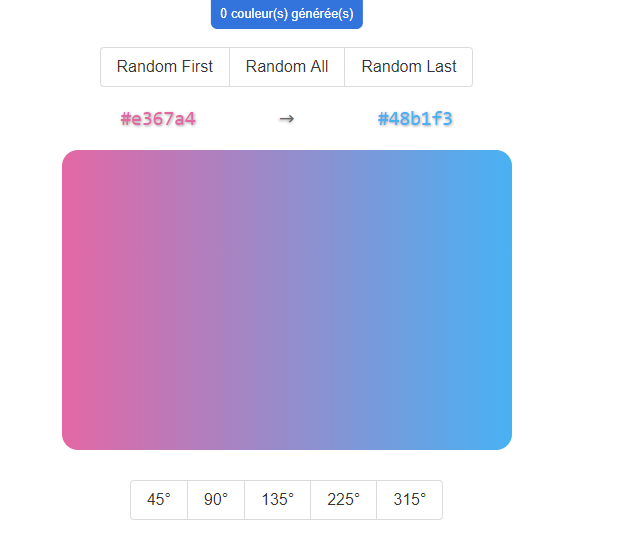

 README
===============

Gradient Generator made with React and Redux

Installation
--------------------


```sh
git clone git@github.com:PierreBeaufils/gradient-generator-react-redux.git
or git clone https://github.com/PierreBeaufils/gradient-generator-react-redux.git

cd gradient-generator-react-redux

# install dependencies
yarn 

# Launch dev server
yarn start 

# Open http://localhost:8080/
```


---

Overview
-------------------------------------------

